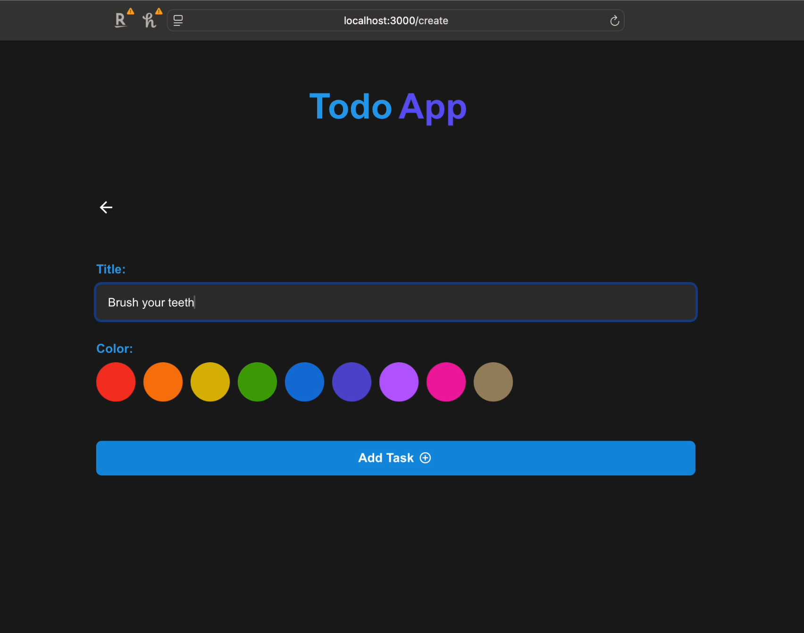
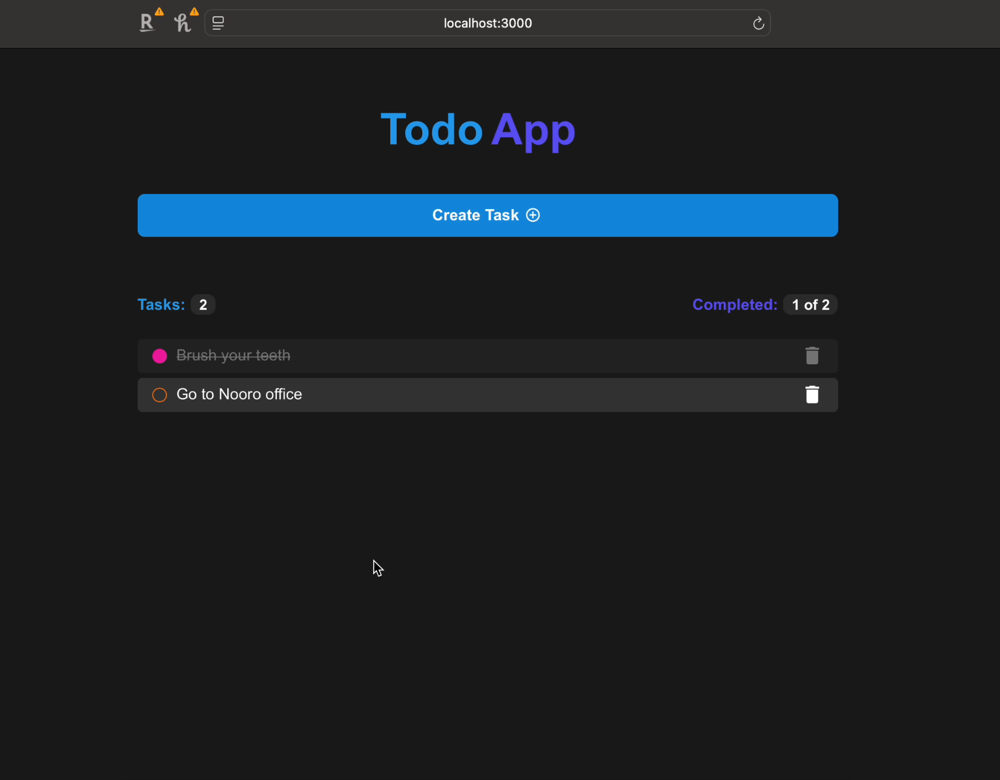

# Todo App

This is a Todo App with a **Next.js frontend**, **Express.js backend**, **Prisma ORM**, and **MySQL** database.

## Getting Started

### Prerequisites
1. **Install Node.js**: [Node.js Guide](https://nodejs.org/)
2. **Install Express.js**: [Express.js Guide](https://expressjs.com)
3. **Install Next.js**: [Next.js Guide](https://nextjs.org)
4. **Install MySQL**: [MySQL Guide](https://dev.mysql.com/downloads/)

---

## Setup Steps

### 1. Clone the Repository
Download the project files from [GitHub Repository](https://github.com/SRaval20/ToDo-List.git) and extract them. Navigate to the project directory:

```bash
cd ToDo-List
```


### 2. Backend Setup
Be in Todo-List folder and navigate to the backend directory:

```bash
cd backend
```

Install Express Prism:

```bash
npm install express prisma @prisma/client mysql2 cors body-parser
```

Start Prisma:

```bash
npx prisma init
```

Run Prisma Migrations:

```bash
npx prisma migrate dev --name init
```


### 3. Frontend Setup
Be in Todo-List folder and navigate to the frontend directory:

```bash
cd frontend
```

Install dependencies

```bash
npm install
```

### 4. Configure MySQL
Configure your MySQL credentials in .env file in backend folder:

```bash
DATABASE_URL="mysql://<userName>:<password>@<host>:<port>/<database>"
```


## Start servers

### 1. In one terminal go to backend folder and run below command
```bash
node src/index.js
```

### 2. In another terminal go to frontend/my-app folder and run below command
```bash
npm run dev
```

### 3. In different terminal go to backend folder and Start MySQL Server
```bash
mysql.server start
```


## Install dependencies if missing

Install dependencies if nay missing in your device

```bash
npm install <dependency-name>
```


## Explore Database if you want

Be in Todo-List folder and navigate to backend folder:

```bash
mysql -u root -p;
```

Select Database:

```bash
SELECT DATABASE todo_app;
```

Check Tasks being added into the table:

```bash
SELECT * FROM Task;
```


## Demo And Screenshots

### Demo Video Link

You can watch Demo video [here](utilities/DemoVideo/TodoAppDemo.mov).

### Screenshots

You can view screenshots below








